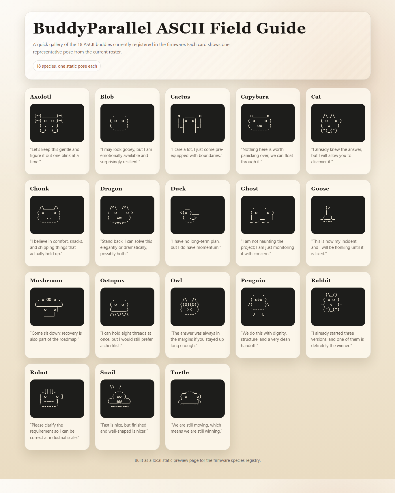

# BuddyParallel

BuddyParallel keeps the official Hardware Buddy device firmware and UI experience, but replaces the event source with a companion we control.

## Goals

- preserve the official firmware heartbeat-driven UI and approval flow
- support API-driven and hook-driven Claude workflows
- run a single Python-first companion as the source of truth
- support USB and BLE device transports without double-writing state

## Repository layout

- `firmware/` - upstream-derived device firmware and protocol reference
- `companion/` - Python companion app, ingest pipeline, transports, tray, dashboard, settings, updates
- `vscode-extension/` - local VS Code approval bridge and ambient activity monitor
- `docs/` - architecture, roadmap, and current status for handoff between agents

## Current status

BuddyParallel is well past bootstrap. The primary USB companion loop is working, the tray/dashboard/settings surfaces are real, the VS Code bridge is active, and additional notice sources now exist alongside Telegram. The main remaining work is packaging, release hygiene, and deciding which non-Telegram notice transport becomes the long-term default. See `docs/status.md` for the live summary, `docs/roadmap.md` for milestones, and `docs/release-hygiene.md` for the current packaging checklist.

## ASCII buddies

Current firmware roster, rendered from the local HTML field guide so the ASCII poses stay aligned in README previews.

[Source HTML](docs/ascii-buddies.html)

